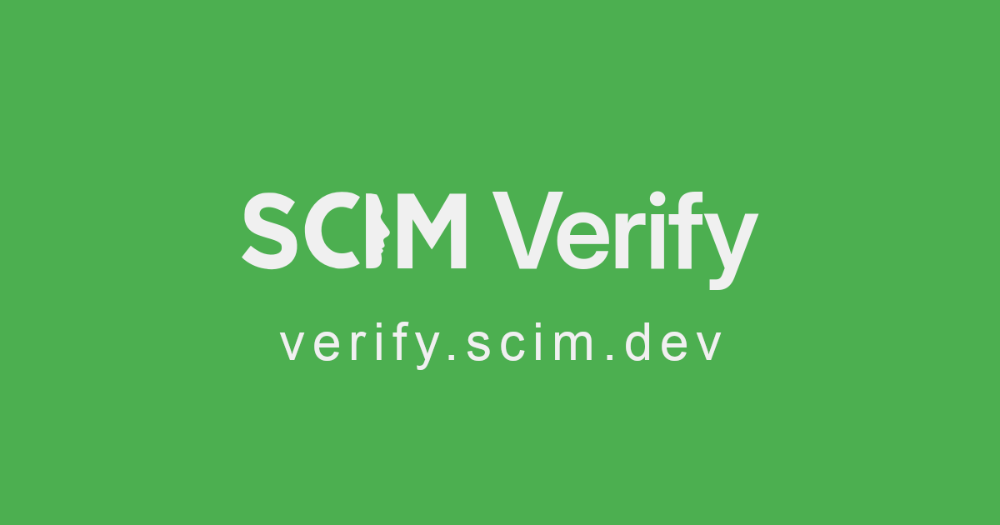

# SCIM Verify

This tool is created to check the SCIM (System for Cross-domain Identity Management) conformance of your SCIM server.

## Usage

~~~
CONFIG_FILE=./site/.vitepress/theme/components/config.yaml \
AUTH_HEADER="Bearer REPLACE_THIS" \
BASE_URL="https://api.scim.dev/scim/v2" \
HAR_FILE_NAME="/output/output.har" \
node --test
~~~

## Features

- Validate SCIM endpoints
- Check compliance with SCIM specifications
- Generate detailed reports on conformance

## Licensing

This tool is available under GPLv3.

Note that other licensing options are available.

## Commercial Support

For organizations requiring additional assistance, commercial support options are available. Please contact scim@a11n.nl for more details.

## Contact

For more information, please visit [verify.scim.dev](https://verify.scim.dev/) or contact us at scim@a11n.nl.

## TODO:

1. Generate example requests and response schemas based on Schema and Resource Types. Leverage AI??